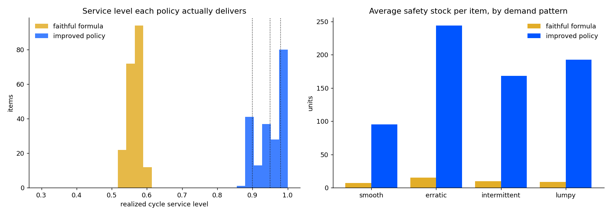

# Inventory Policy Engine (MIN / OPHQ / MAX)

Computes a stocking policy for every item, a reorder trigger (MIN), an order-up-to
target (OPHQ), and an upper trigger (MAX), in two versions side by side: a faithful
reproduction of a real KNIME calculation, and an improved policy that fixes the one
thing the original gets wrong. The engine then measures the service level each
version actually delivers, so the difference is shown, not asserted.

This is the policy layer of the network system. It sits between the demand
forecasting engine, which gives it demand mean and standard deviation, and the
container and transfer engines, which consume its MIN and MAX as triggers. The improved policy is the adopted implementation; the faithful engine is retained only as the reference baseline for the comparison.

---

## Contents

1. The problem and the review finding
2. Architecture and the pipeline it sits in
3. The faithful engine
4. The improved engine
5. Evaluation and results
6. Limitations
7. Future work
8. Using the engine
9. Project structure
10. References

---

## 1. The problem and the review finding

The original computed MIN, OPHQ, and MAX by transaction colorway code from a KNIME
workflow and pushed them to the warehouse system monthly. The backbone is sound:
it anchors the policy to lead-time demand and uses per-supplier lead time, which is
right, since foreign suppliers have different lead times.

The review found one root error that explains most of the rest. The formula scales
mean lead-time demand by fixed multipliers: MIN by 1.04, MAX by 1.28, and a quantity
multiple by 0.84. Those three numbers are almost exactly the service-level z-scores
for 85, 90, and 80 percent (1.036, 1.282, 0.842). So the intent was clearly a
service level, but the z-score was multiplied against the mean instead of being
applied to the standard deviation of lead-time demand. Safety stock should be z
times sigma, not z times the mean. Multiplying the mean makes the buffer scale with
how much you sell rather than with how uncertain it is, so two items with the same
average but very different variability get the identical buffer, and the service
level actually delivered drifts item by item and is neither controlled nor knowable.

Three consequences follow: demand variability is ignored, lead-time variability is
ignored entirely (only mean lead time is used, which under-buffers exactly the
imported items that are riskiest), and OPHQ is normalized to weekly units while MIN
and MAX are in lead-time units, so nothing guarantees MIN is at most OPHQ is at most
MAX.

There is one more telling detail. The service-level sheet's own callout states the
correct formula in words, sigma_LT times Z times D_Avg, which is proper lead-time-
variability safety stock. None of the six KNIME steps implement it; they all
multiply mean lead-time demand by the z-value instead. So the document knows the
right formula and the nodes compute a different one. The improved engine below
implements what the callout actually asks for, and adds the demand-variability term
the callout omits.

---

## 2. Architecture and the pipeline it sits in

```
demand forecast (mean, std)  --.
per-supplier lead time -------->  inventory policy engine  -->  MIN / OPHQ / MAX per item
ABC class + service target ----'                                (feeds container + transfer engines)
```

The primary home owns a single policy. Secondary and tertiary buildings are fallback
assignment ranks only, not separate policies, which reconciles the three-tier spec
with the single-home decision. The MIN and MAX this engine produces are the exact
triggers the transfer engine later uses: quantity below MIN pulls up to OPHQ, and
quantity above MAX pushes down to OPHQ, which is reverse replenishment.

---

## 3. The faithful engine

A verbatim transcription of the KNIME math nodes, now with the OHQ Service Level
fields defined from the service-level sheet rather than assumed. That sheet defines
three confidence levels of no stockout, each as mean lead-time demand times a
z-value, and a weekly version of each:

```
OHQ Service Level 3 = Total Lead Time Days * daily demand * 0.84   (80% confidence)
OHQ Service Level 4 = Total Lead Time Days * daily demand * 1.04   (85% confidence)
OHQ Service Level 5 = Total Lead Time Days * daily demand * 1.28   (90% confidence)
Weekly OHQ Service Level k = (OHQ Service Level k / Total Lead Time Days) * 7
```

The MIN/MAX sheet then wires them together:

```
MIN            = lead-time demand * 1.04   (equals OHQ Service Level 4)
MAX            = lead-time demand * 1.28   (equals OHQ Service Level 5)
Quantity Multiple = lead-time demand * 0.84 (equals OHQ Service Level 3)
ABC Demand Value  = Weekly OHQ Service Level 3 = daily demand * 7 * 0.84
OPHQ              = Weekly OHQ Service Level 4 = daily demand * 7 * 1.04
```

Two flaws are reproduced honestly rather than fixed. The z-values multiply mean
lead-time demand rather than its standard deviation, so the buffer ignores
variability. And OPHQ is one week of stock while MIN is a full lead time of stock,
so for any item whose lead time exceeds seven days, OPHQ falls below MIN. On the
demo catalog that is 100 percent of items: the post-action target sits below the
reorder trigger it is supposed to sit above, often by a wide margin.

---

## 4. The improved engine

Same backbone, corrected buffer:

- Service target per ABC class (A 98, B 95, C 90 by default, configurable), so the
  target is an explicit business decision rather than a hidden multiplier.
- MIN is the service-level quantile of lead-time demand. Mean lead-time demand is
  mu = lead_time_mean times daily_demand. Its standard deviation is
  sigma = sqrt(lead_time_mean times demand_var + daily_demand^2 times lead_time_var),
  the standard combined formula, which finally uses both the demand spread from the
  forecasting engine and the supplier lead-time spread. For smooth and erratic items
  MIN = mu + z times sigma. For intermittent and lumpy items the normal curve
  under-covers the right tail, so MIN is the quantile of a gamma distribution
  moment-matched to the same mean and variance, a standard treatment for spiky demand.
- Order quantity comes from a review-period cover, floored at MOQ and rounded up to
  pack, which is where the 0.84 quantity multiple actually belongs. OPHQ = MIN + Q
  and MAX = OPHQ + Q, so MIN is at most OPHQ is at most MAX holds by construction.

---

## 5. Evaluation and results

For every item the engine simulates many lead-time-demand outcomes from its true
process and counts how often MIN covers demand. That realized cycle service level is
compared to the item's target. Safety stock held (MIN above mean lead-time demand)
is a proxy for working capital.

Results on the synthetic catalog (200 items, 8 suppliers with 5 import and 3
domestic, service targets A 98, B 95, C 90). Illustrative, from the included
generator, not a claim about any real catalog:

| policy | mean realized service | spread (std) | mean gap to target | items 5+ pts below target | total safety stock |
| --- | --- | --- | --- | --- | --- |
| faithful formula | 0.565 | 0.017 | 0.384 | 100% | 2004 |
| improved policy | 0.950 | 0.034 | 0.004 | 0% | 32517 |

The faithful formula delivers about 56 percent cycle service uniformly, far below
the 85 to 90 percent its multipliers imply, because a reorder point at 1.04 times
the mean barely clears the median. Every item lands more than five points under
target. The improved policy hits the target almost exactly, and by class: A 98.1,
B 95.1, C 90.0.

The cost is much more safety stock, which is the honest price of real service, not a
defect. Where that capital goes is the other half of the story: the improved policy
places 87 percent of its safety stock on imported items, where the long and variable
lead times actually create the risk, while the faithful formula spreads a thin flat
buffer everywhere and protects nothing well.



---

## 6. Limitations

The gamma quantile for intermittent and lumpy items is moment-matched to mean and
variance, not fitted to full history. It respects skew without peeking at the data
generator, which is the fair test, but a production version would fit the
distribution to each item's demand.

The demo runs on synthetic data so the project is inspectable without proprietary
inputs. Service targets, MOQ, pack, and review period are defaults, marked
configurable.

---

## 7. Future work

- A cost-based service level: given holding and stockout costs, set each item's
  service level from the newsvendor critical ratio, which makes optimal holding
  quantity actually optimal rather than a label.
- Economic order quantity in place of a flat review-period cover, with real ordering
  and holding costs and pallet rounding.
- Correlated demand and lead time, which the combined-variance formula assumes are
  independent.
- A direct handoff to the transfer engine, feeding MIN and MAX as the forward and
  reverse replenishment triggers.

---

## 8. Using the engine

Standalone, on the included synthetic catalog:

```bash
pip install -r requirements.txt
python scripts/run_demo.py
```

As a module:

```python
from inventory_policy import generate, faithful_policy, improved_policy, compare

data = generate()                               # or supply your own items frame
faithful = faithful_policy(data["items"])
improved = improved_policy(data["items"])       # service targets configurable
table, faithful_detail, improved_detail = compare(data["items"], faithful, improved)
```

Inputs are a per-item demand forecast (weekly or daily mean and standard deviation),
an assigned supplier with lead-time mean and standard deviation, an ABC class with a
service target, and pack and MOQ. The forecast comes from the demand engine; this
engine produces the policy.

---

## 9. Project structure

```
inventory-policy-engine/
  README.md                 this document
  requirements.txt
  src/inventory_policy/
    sim.py                  shared demand model (truth for estimation and evaluation)
    classify.py             ABC classification and service targets
    data.py                 synthetic catalog generator
    faithful.py             verbatim reproduction of the KNIME MIN/OPHQ/MAX formula
    improved.py             variability-based, pattern-aware policy
    evaluate.py             realized service simulation and comparison
    pipeline.py             plan(): catalog in, policy out
  scripts/run_demo.py       end-to-end demo, figure and exports
  tests/                    formula reproduction, ordering, target attainment, allocation
  assets/                   generated figure
  data/                     sample catalog, suppliers, and policy comparison output
```

---

## 10. References

Chopra, S., and Meindl, P. (2016). Supply Chain Management: Strategy, Planning, and
Operation, 6th ed. Pearson. (Cycle service level and safety inventory.)

Nahmias, S. (2009). Production and Operations Analysis, 6th ed. McGraw-Hill. (Reorder
point and the newsvendor critical ratio.)

Silver, E. A., Pyke, D. F., and Peterson, R. (1998). Inventory Management and
Production Planning and Scheduling, 3rd ed. Wiley. (Safety stock and the combined
demand and lead-time variability formula.)

Syntetos, A. A., and Boylan, J. E. (2005). The accuracy of intermittent demand
estimates. International Journal of Forecasting, 21(2), 303-314. (Why intermittent
and lumpy demand need non-normal treatment.)
